# BookShare

Peer-to-peer book lending and exchange platform built on a Node.js
microservices architecture. The application is a four-protocol showcase:
**REST** + **GraphQL** for client traffic, **gRPC** between the API
gateway and the four microservices, and **Kafka** for asynchronous
business events. Each microservice owns its own database; cover images
live in a MinIO object store.



## Stack

- **Frontend:** React 19 + Vite + React Router + Apollo Client + axios + Tailwind CSS 3.
- **Gateway:** Express 5 + Apollo Server 5 (GraphQL) + `@grpc/grpc-js` clients + JWT auth.
- **Microservices:** Node 20 + `@grpc/grpc-js` (no Express). Each owns its own database (SQLite3 or RxDB).
- **Async:** Kafka in KRaft mode (no Zookeeper) — four topics, two distinct consumer groups.
- **Storage:** MinIO (S3-compatible) bucket for cover images, used by `book-service` only.
- **Orchestration:** Docker Compose — eight containers, healthchecks, named volumes for persistence.

## Prerequisites

- Docker 20+ and Docker Compose v2 (included with Docker Desktop).
- Node.js 20 LTS — only needed if you want to run individual services outside Docker for development.

## Quickstart

```bash
git clone https://github.com/Med-Marz/BookShare.git
cd BookShare

# 1. Copy environment template (defaults work out of the box).
cp .env.example .env

# 2. Bring up the full stack (builds images on first run; ~3-5 minutes).
docker compose up -d --build

# 3. Watch the containers reach 'healthy'.
docker compose ps
```

Once every container shows `healthy`:

| Surface | URL |
| --- | --- |
| React client | http://localhost:8080 |
| Gateway REST | http://localhost:4000/api/v1 |
| Gateway GraphQL | http://localhost:4000/graphql |
| Gateway health | http://localhost:4000/health |
| MinIO console | http://localhost:9001 (login with `MINIO_*` creds from `.env`) |

Stream logs from every service interleaved:

```bash
docker compose logs -f
```

Tear down (preserve data):

```bash
docker compose down
```

Tear down and wipe persistent volumes:

```bash
docker compose down -v
```

## Demo walkthrough

With the stack running, you can exercise every protocol in five minutes
from the React UI alone:

1. **Sign up.** Open http://localhost:8080 → click **Sign up** → fill in the form → you land back on Home as an authenticated user. *(REST: `POST /api/v1/auth/signup` → gateway → gRPC to user-service → SQLite insert.)*
2. **Add a book with a cover.** Click **Add a book** → upload a JPEG/PNG/WebP → submit. The cover round-trips through the gateway via MinIO; the catalog updates immediately.
3. **Browse and search.** Open `/books` for the paginated catalog (8 per page). Use the navbar search to find a book by title, author, or owner name. *(REST: `GET /api/v1/search?q=...`)*
4. **Reserve someone else's book.** Click any `Available` book by another reader → **Reserve**. The status badge flips to `Reserved` within ~1 second (Kafka propagation), and the owner's notifications badge increments in their browser session.
5. **Watch the lifecycle propagate.** Sign in as the book's owner in a second browser → visit `/profile` → "Reservations on my books" panel shows the new entry → click **Mark loan started** → the book's status flips to `Lent Out`. Click **Mark returned** when the book comes back.
6. **Read your notifications.** Each Kafka event produces a row in the recipient's notifications. Click the Bell icon in the navbar → `/notifications` lists them with topic icons and timestamps.

### Watch the Kafka multi-consumer pattern live

While performing step 4 above, in a second terminal:

```bash
docker compose logs -f loan-service book-service notification-service
```

Each reserve produces three log lines — one from loan-service (producer)
and one each from book-service and notification-service (two distinct
consumer groups on the same topic). This is the multi-consumer pattern at
work: one event, two independent side effects.

## Local development (without Docker)

For fast iteration on a single workspace, install all deps once at the root and run individual workspaces with hot reload:

```bash
npm install

# Frontend on http://localhost:5173 with HMR
npm run dev -w apps/web

# Gateway on http://localhost:4000 with nodemon reload
npm run dev -w apps/gateway

# Individual microservice (substitute the workspace name)
npm run dev -w services/user-service
```

Kafka and MinIO still run from Docker even in this mode: `docker compose up -d kafka minio`.

## Quality

```bash
npm run lint           # eslint across every workspace
npm run format         # prettier --write
npm run format:check   # prettier --check (used in CI-style verification)
```

## Repository layout

```
apps/
├── web/                React + Vite + Tailwind client (served by nginx in Docker)
└── gateway/            Express + Apollo Server, the only client-facing HTTP entry point
services/
├── user-service/       Accounts, auth, profile (SQLite)
├── book-service/       Catalog, covers (MinIO), availability state (RxDB)
├── loan-service/       Reservations, loans, Kafka producer (SQLite)
└── notification-service/  Kafka consumer + mock notification log (SQLite)
proto/                  Shared .proto contracts + Kafka event documentation
docs/                   Project documentation (this README's deep-dive files)
postman/                Public Postman demo collection
docker-compose.yml      8-service orchestration with healthchecks
```

## Documentation

The deep-dive technical documentation:

- **[`docs/architecture-diagram.svg`](docs/architecture-diagram.svg)** — system diagram (source at `docs/architecture-diagram.mermaid`).
- **[`docs/REST-endpoints.md`](docs/REST-endpoints.md)** — every REST route with body shape, auth, errors, and the gRPC → HTTP status table.
- **[`docs/GraphQL-schema.md`](docs/GraphQL-schema.md)** — full schema, three example queries, cross-service fan-out explained.
- **[`docs/Kafka-topics.md`](docs/Kafka-topics.md)** — per-topic producer/consumers/payloads/side effects.
- **[`docs/Database-descriptions.md`](docs/Database-descriptions.md)** — per-service DB schemas and rationale.
- **[`proto/*.proto`](proto/)** + **[`docs/kafka-events.md`](docs/kafka-events.md)** — gRPC contracts and Kafka envelope.

## Postman collection

A public Postman workspace ships alongside the GitHub repo with two
collections:

- **BookShare** — 17 REST + GraphQL requests, each paired with a saved
  example response. Covers signup, login, profile, browse, search, book
  detail, reserve, cancel, my reservations, notifications, the flagship
  GraphQL cross-service join, and a search query.
- **BookShare gRPC** — 6 representative gRPC calls (one per service,
  including ListNotifications + CountUnreadNotifications), each with a
  saved example response.

The repo-side source of the REST/GraphQL collection lives at
[`postman/BookShare.postman_collection.json`](postman/BookShare.postman_collection.json)
and can be imported into any Postman workspace.

## Deliverables — quick map

| Deliverable | Location |
| --- | --- |
| Source code | this repository |
| Architecture diagram | [`docs/architecture-diagram.svg`](docs/architecture-diagram.svg) |
| `.proto` contracts | [`proto/*.proto`](proto/) |
| REST endpoint descriptions | [`docs/REST-endpoints.md`](docs/REST-endpoints.md) |
| GraphQL schema description | [`docs/GraphQL-schema.md`](docs/GraphQL-schema.md) |
| Kafka topic descriptions | [`docs/Kafka-topics.md`](docs/Kafka-topics.md) + [`docs/kafka-events.md`](docs/kafka-events.md) |
| Database descriptions | [`docs/Database-descriptions.md`](docs/Database-descriptions.md) |
| Install + run instructions | [Quickstart](#quickstart) |

## License

MIT — see `LICENSE`.
